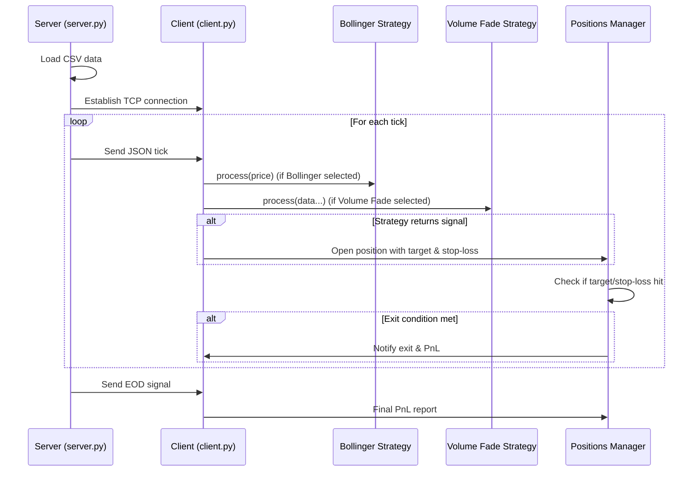
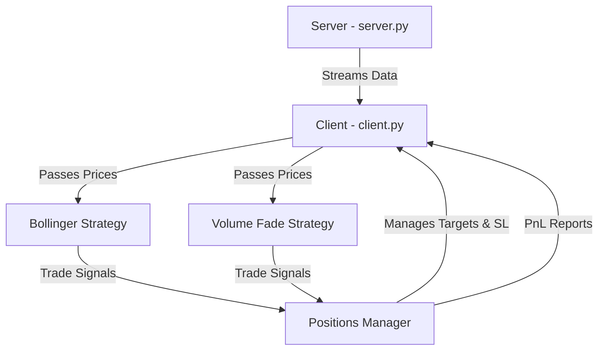

# Algo-Trade Sim

Algo-Trade Sim is a simple algorithmic trading simulator that streams market data from a server to a client, applies trading strategies, and manages positions with automated target and stop-loss handling.

## Features

- **Bollinger Mean Reversion Strategy**: Generates buy/sell signals based on Bollinger Bands.
- **Volume Fade Strategy**: Example of an alternative trading approach (mean reversion based on volume patterns).
- **TCP Client-Server Streaming**: Simulated real-time data feed using sockets.
- **Positions Manager**: Handles trade entries, exits, and PnL tracking.
- **Multi-Process Safe**: Uses Python multiprocessing Manager for safe shared state across processes.

## Project Structure

```
algo-trade-sim/
│
├── strategies/
│   ├── bollinger_mean_reversion.py
│   ├── volume_fade.py
│
├── client.py
├── positions_manager.py
├── server.py
└── option_data.csv (sample market data)
```

## Flowchart

Below is a high-level overview of how the system works:


## Sequence Diagram



## Component Interaction



## How It Works

1. **Server (`server.py`)** streams option price data from a CSV file over a TCP socket.
2. **Client (`client.py`)** connects to the server, receives price ticks, and passes them to the selected trading strategy.
3. **Strategies** (e.g., Bollinger Mean Reversion) decide when to open positions.
4. **Positions Manager** automatically closes trades when the target or stop-loss is hit and tracks realized PnL.
5. The simulation ends when the server sends an End-Of-Data (`EOD`) signal.

## Usage

1. **Start the server** in one terminal:
```bash
python server.py
```

2. **Start the client** in another terminal:
```bash
python client.py
```

3. Watch the console for trade entries, exits, and PnL updates.

## License

This project is licensed under the MIT License.
